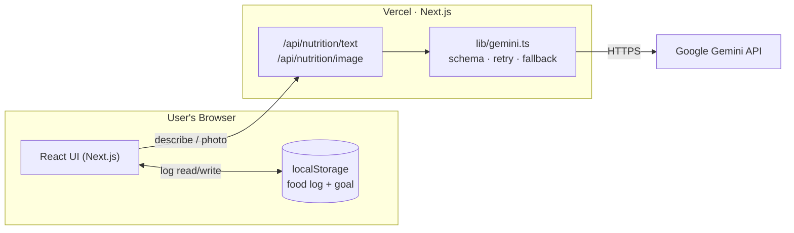

# NutriTrack 🥗

An AI-powered calorie & macro tracker. Quick-add common foods, **describe a meal in plain
English**, or **snap a photo** — Google Gemini estimates the nutrition. Track progress toward
a daily goal with a live ring, macro bars, and meals grouped by Breakfast / Lunch / Dinner / Snack.

**▶ Live demo:** https://nutritrack-ai-three.vercel.app

> No login. The food log is saved in your browser; AI lookups run server-side so the API key stays secret.

## How it works



Logging happens entirely in the browser (works on Vercel's read-only filesystem with no DB);
AI nutrition lookups go through Next.js route handlers to Gemini. Full diagrams (request
sequences, component tree, deploy pipeline) are in **[docs/ARCHITECTURE.md](docs/ARCHITECTURE.md)**.

## Features

- **Three ways to add food** — quick-add catalog, AI text lookup, AI photo recognition
- **Confirm-before-add** review of AI-detected items (with image preview for photos)
- **Daily goal ring** (green → amber → red) + protein/carbs/fat **macro bars**
- **Meals** grouped with subtotals; card-style entries; loading / empty / error states
- Responsive, dark mode, accessible; Gemini calls **retry + fall back** to a healthy model

## Quick start

```bash
git clone git@github.com:kvvinaykumar10121982/nutritrack-ai.git
cd nutritrack-ai
npm install
cp .env.example .env      # add a free Gemini key → GEMINI_API_KEY
npm run dev               # http://localhost:3000
```

The core tracker runs with no key; the AI features need a free key from
[Google AI Studio](https://aistudio.google.com/apikey).

## Tech stack

Next.js 16 (App Router) · React 19 · TypeScript · Tailwind CSS 4 · `@google/genai`
(`gemini-2.5-flash-lite`) · localStorage (with Upstash Redis / lowdb wired for future
cross-device sync).

## Docs

- **[docs/ARCHITECTURE.md](docs/ARCHITECTURE.md)** — diagrams & data flow
- **[CLAUDE.md](CLAUDE.md)** — project overview, folder structure, API reference
- **[PLAN.md](PLAN.md)** — what was built, improved, and the roadmap
- **[docs/](docs/)** — dated decision logs
