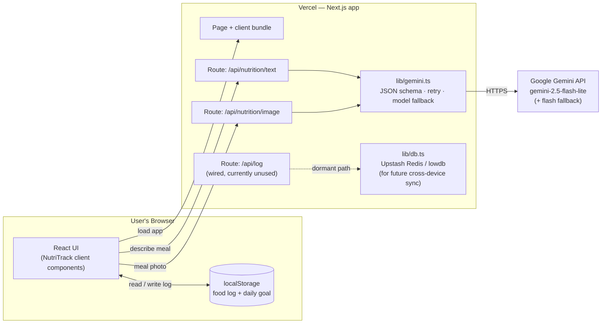
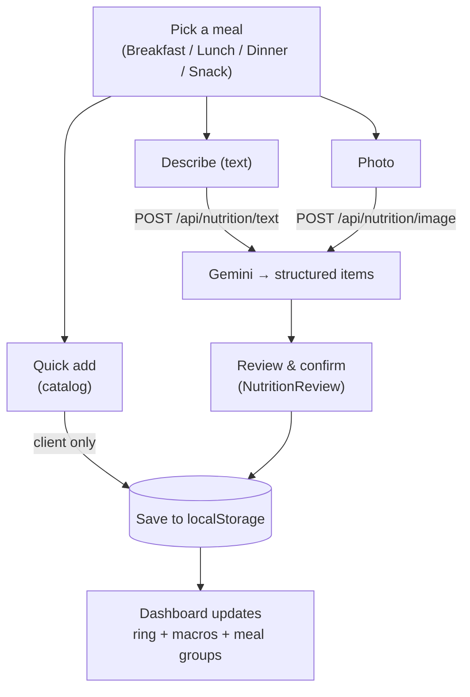
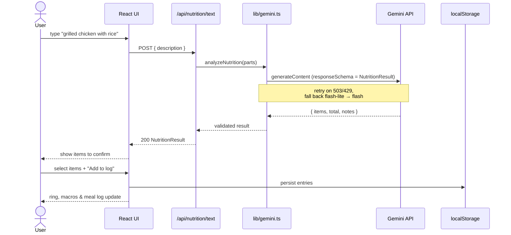
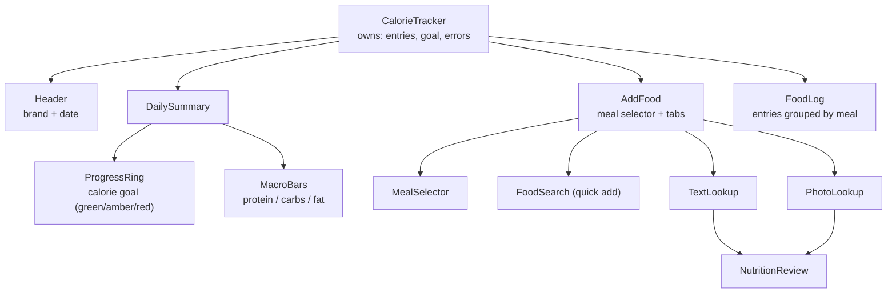
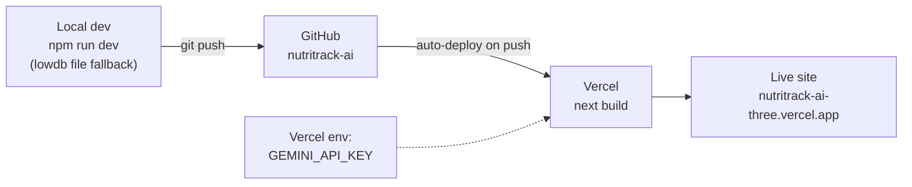

# NutriTrack — Architecture

How the app is put together and how data flows. Diagrams are [Mermaid](https://mermaid.js.org/)
and render automatically on GitHub.

- **Live:** https://nutritrack-ai-three.vercel.app
- **Stack:** Next.js 16 (App Router) · React 19 · TypeScript · Tailwind 4 · Google Gemini

---

## 1. System overview

Two responsibilities split cleanly:

- **Logging** runs entirely in the **browser** (`localStorage`) — fast, offline-friendly,
  and works on Vercel's read-only filesystem with no database.
- **AI nutrition lookup** runs on the **server** (Next.js route handlers) so the Gemini
  API key stays secret, then returns structured JSON the UI confirms before logging.



> **Note:** The food log currently lives only in the browser. The server `/api/log`
> routes and `lib/db.ts` (Upstash Redis with a lowdb local fallback) are implemented and
> tested but **not used by the UI yet** — they're the upgrade path to cross-device sync.

---

## 2. The three ways to add food



- **Quick add** never touches the server — the food is already in `lib/foods.ts`.
- **Describe / Photo** call Gemini, then the user confirms the detected items before they're
  written to the log (AI estimates can be wrong, so nothing is logged automatically).

---

## 3. Request flow — AI text lookup



The **photo** flow is identical except the UI sends `multipart/form-data` with an image,
which `lib/gemini.ts` forwards to Gemini as inline base64.

---

## 4. Component tree (client)



`CalorieTracker` is the single source of truth for state; everything below it is
presentational and talks back through callbacks (`onAddFood`, `onAddItem`, `onRemove`, …).

---

## 5. Data model

```ts
type MealCategory = "breakfast" | "lunch" | "dinner" | "snack";
type Food     = { id; name; servingSize; calories; protein; carbs; fat };
type LogEntry = Food & { entryId; loggedAt; meal };   // one logged food
// AI lookups return:
type NutritionResult = { items: NutritionItem[]; total: Totals; notes?: string };
```

- The food **catalog** (`lib/foods.ts`) is static code — only the **log** is stored.
- "Today" = entries whose `loggedAt` is on the current calendar day.

---

## 6. Deploy pipeline



- Push to `master` → Vercel builds and deploys automatically (repo is connected).
- `GEMINI_API_KEY` is set in Vercel project env (never committed; see `.env.example`).
- `.vercelignore` keeps local-only files (`data/`, `dev.log`, `docs/`) out of deploys.

---

## 7. Future: cross-device sync (already wired)

To move the log from the browser to a shared server store:

1. Vercel dashboard → **Storage → connect Upstash Redis** (injects `UPSTASH_REDIS_REST_URL`
   / `_TOKEN`).
2. Point `CalorieTracker` back to the `/api/log` routes (instead of `lib/localLog.ts`).
3. Redeploy. `lib/db.ts` already picks Redis when those env vars exist, lowdb otherwise.
